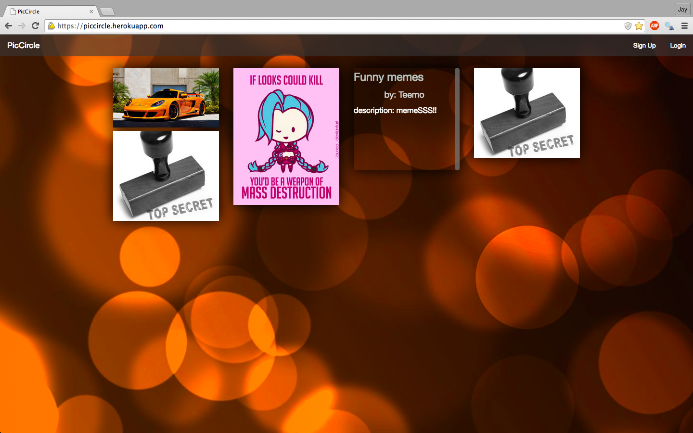

PicCircle is a web application based on public/private groups named circles where
users can share pictures and chat in a visually appealing manner.

Here are some screenshots of PicCircle

Index page:

Circle page:

Jan 13, 2015

- Created my database for circles
  - created all the CRUD functionality for circles, comments with the correct associations in ActiveRecord.

Jan 15, 2015

- Implemented devise gem for user authentication
- Added a way to add pictures from the internet
- Installed masonry-rails gem and fiddled with it to work with foundation because the 2 grid systems were not implementing well with each other
  - played with some jquery to get the images to load before the masonry-rails layout happens

Jan 16, 2015

- Created chatbox through the use of some jquery/ajax that I followed from a tutorial

Jan 17, 2015

- Wanted to create a feature on privatizing groups
  - added some testing to develop this feature finished making groups private and started working on joining/approving groups

Jan 18, 2015

- approving works for everyone but not exclusively on one person

Jan 19, 2015

- through testing finally got approval to work on a selected user

Jan 20, 2015

- worked on some CSS and foundation styling

Jan 21, 2015

- worked on fixing masonry with foundation as it was a bit buggy and added some javascript to items to have animation

Jan 22, 2015

- replaced uploading images to paperclip with AWS S3

Jan 23, 2015

- finished up some styling and added validations to models
